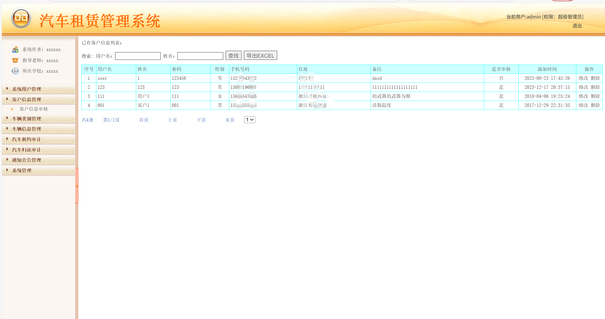

# spServlet013
spServlet013汽车租赁管理系统+BG
 
## 查看主页获取源码

### 一、关键词

汽车租赁管理系统，汽车租赁系统

### 二、作品包含
源码+数据库+设计报告文档+全套环境和工具资源+本地部署教程

### 三、项目技术
前端技术：Html、Css、Js、Jquery
后端技术：Java、JSP、Servlet、JDBC

### 四、运行环境（以下版本亲测，其他版本兼容性请自行测试）
开发工具：IDEA/eclipse

数据库：MySQL5.7或8.0

服务器：Tomcat8.5或Tomcat9.0

数据库管理工具：Navicat10以上版本

环境配置软件： JDK1.8

浏览器：谷歌浏览器

### 五、项目介绍
项目编号：jspServlet013

汽车租赁是近几年在我国兴起的服务行业，随着人们物质生活的提高，自驾成为了热门外出旅行的方式。同时，租赁汽车的生活方式也逐渐渗透进人们的日常生活中，成为人们首要选择的出行方式。然而，传统的租赁汽车公司存在着诸多弊端：汽车种类无法及时得到更新，车辆归还信息无法同步，客户无法查看完整汽车信息等问题，因此将汽车租赁系统网络化可以更好的帮助管理员高效率的完善服务水准，节约人力物力等运营成本，同时还能提高客户的租赁与服务体验。

汽车租赁系统分后台管理员模式与前台用户模式：
管理员（后台）：可管理系统用户信息、通知活动、车辆变动、租车情况及自身信息 。
用户（前台）：能进行用户注册、查看车辆信息、在线留言、预定车辆 ，实现租车业务的双向操作与管理 。

### 六、运行截图

